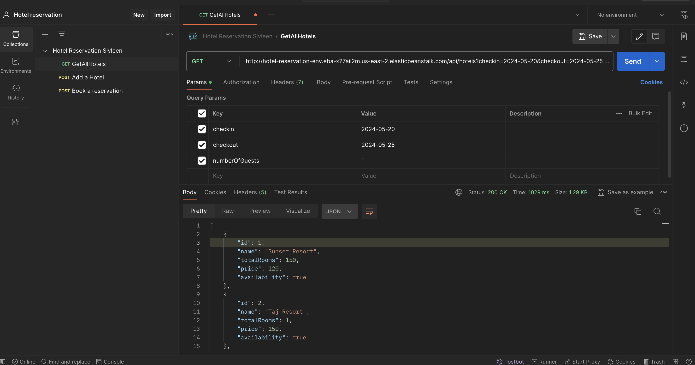
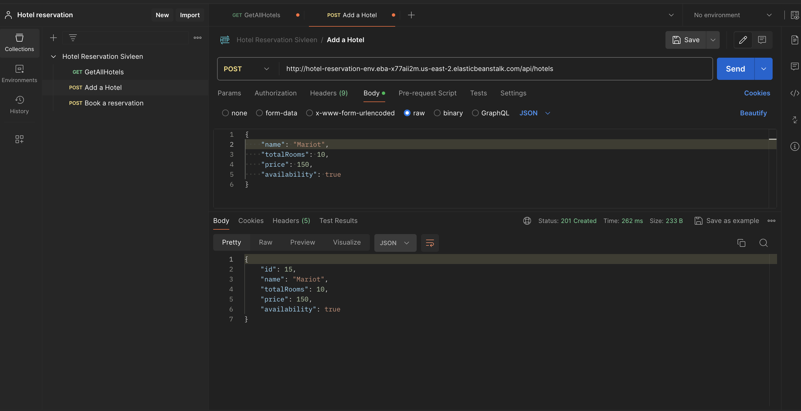
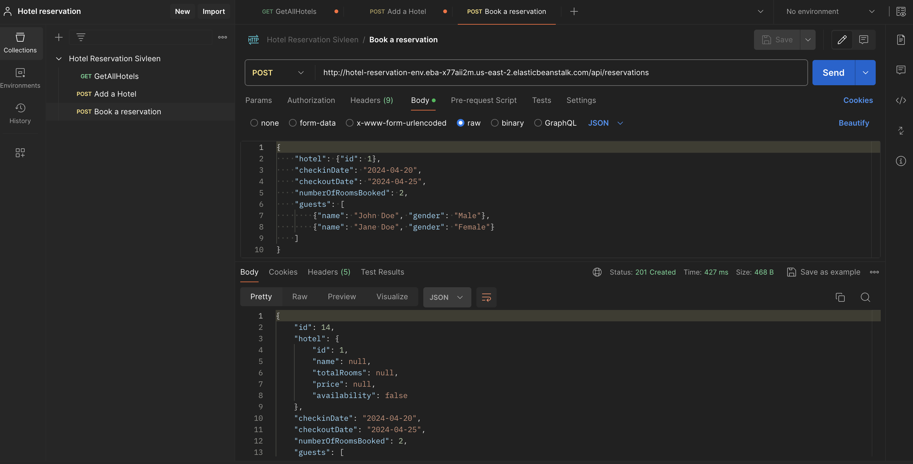

# Hotel Reservation System API

This project is a Java Spring Boot application for managing hotel reservations. It provides endpoints for retrieving a list of hotels, adding new hotels to the system and keeping track of reservations. The application is deployed on AWS Elastic Beanstalk, ensuring scalable and reliable hosting.

## Getting Started

To run the application locally, follow these steps:

### Prerequisites

- Java Development Kit (JDK) installed on your machine
- Maven installed on your machine
- MySQL installed on your machine

### Installation

1. Clone the repository
2. Navigate to the project directory
3. Build the project using Maven
4. Run the application


## API Endpoints

### Get List of Hotels

- **Endpoint:** `GET /api/hotels`
- **Description:** Fetches a list of all hotels available in the database.
- **CURL Example:**
  ```
  curl --location 'http://hotel-reservation-env.eba-x77aii2m.us-east-2.elasticbeanstalk.com/api/hotels?checkin=2024-05-20&checkout=2024-05-25&numberOfGuests=1' \
  --header 'Accept: application/json'
  ```

### Add a New Hotel

- **Endpoint:** `POST /api/hotels`
- **Description:** Adds a new hotel to the database.
- **CURL Example:**
  ```
  curl --location 'http://hotel-reservation-env.eba-x77aii2m.us-east-2.elasticbeanstalk.com/api/hotels' \
  --header 'Content-Type: application/json' \
  --data '{
    "name": "Oberoi",
    "totalRooms": 10,
    "price": 150,
    "availability": true
  }'
  ```

### Add a Reservation

- **Endpoint:** `POST /api/reservations`
- **Description:** Adds a new reservation to the database.
- **CURL Example:**
  ```
  curl --location 'http://hotel-reservation-env.eba-x77aii2m.us-east-2.elasticbeanstalk.com/api/reservations' \
  --header 'Content-Type: application/json' \
  --data '{
    "hotel": {"id": 1},
    "checkinDate": "2024-04-20",
    "checkoutDate": "2024-04-25",
    "numberOfRoomsBooked": 2,
    "guests": [
        {"name": "John Doe", "gender": "Male"},
        {"name": "Jane Doe", "gender": "Female"}
    ]
  }'
  ```

Screenshots
-----------

### GET Hotels Request


### POST Hotel Request


### POST Reservation Request

